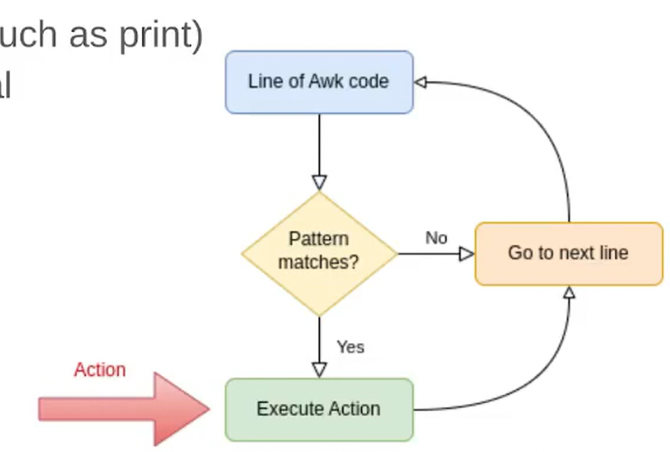
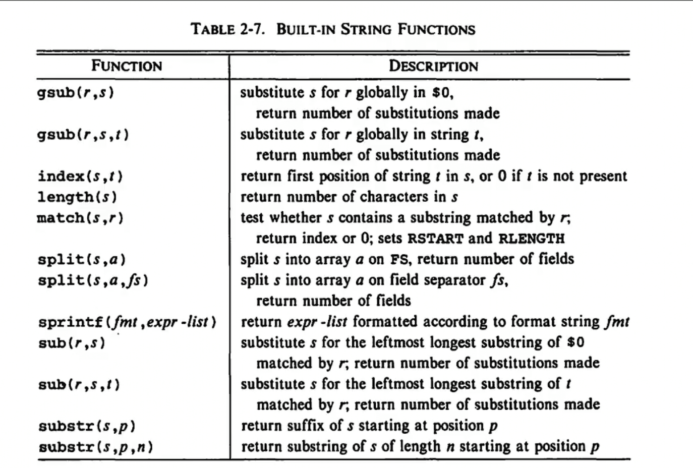
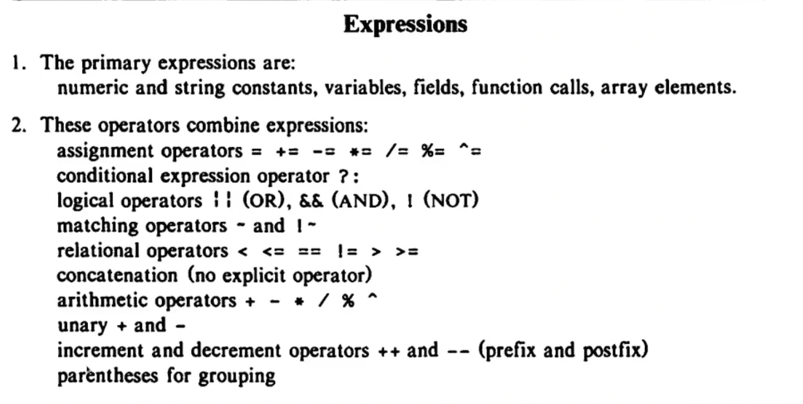

## TODO


## Useful Snippets

1. print __the last field__ of records; print the last `nth`  field with `$(NF - n)`

```awk
{ print $NF }
```

## Pitfalls

1. `pipe` 不能连续使用，只能有一个管道，而且管道的输出会直接去到标准输出，没有办法用变量收集
2. `array`, 实际上是类似于lua里面的table, 可以有数字键，也可以有字符串键


## history

1. awk in fact, inspires languages like `perl` and `ruby`
2. awk is Turing complete
3. awk is dedicated for string processing

## Design

1. A lot of implicit thing, like default `action`, default `pattern`; it is because when awk is invented, keystrokes, in another word, IO resources is valuable. Many people share a small slice of CPU.



## usage

### Generals

1. `expression {action}`, `expression` can be `regex` pattern, also common seen expressions something like `NR == 2 `
2. in fact, `regex` pattern is a shorthand for `$0 ~ /regex/`
3. functions call in `awk`: `()` can be omitted, inspiring `ruby` somehow, and parameter separator can be either `<space>` or `,`
4. there is `array` type in awk
5. it can load `module` with `@load`
6. you can __call other command line tools in awk__, also `piping` with `|` and `redirecting` with `>` 

### Builtin Functions

1. `printf`, just a C-like `printf` sharing the same features
2. A lot of `C` math functions, like `atan2`, `sqrt`, `rand`
3. 

NOTE: `gsub` does not work as this picture claims, it acutally replace the 1st arg with the 2nd

#### Examples

```shell
# substitute all `root` for `good`
ps aux | awk ' { gsub("root" , "good", $0); print }'
```

```shell
# NOTE: 1 index
# this program print usernames without the 1st letter
ps aux | awk '{ a = substr($1, 2); print a}'
```


### Expressions



### Builtin Auto Variables


## Resources

1. 
